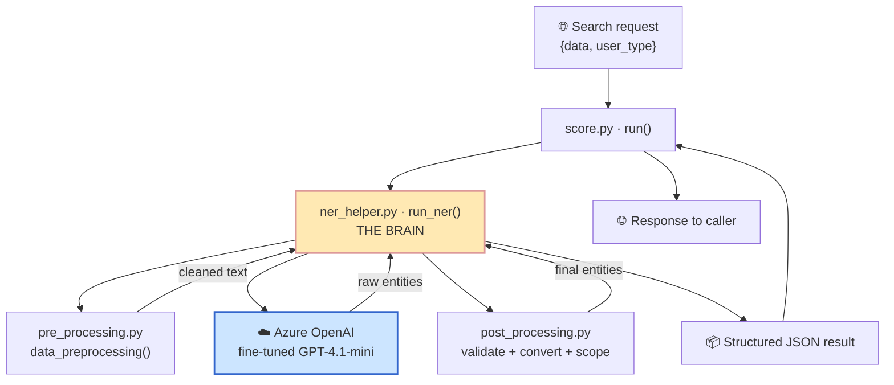
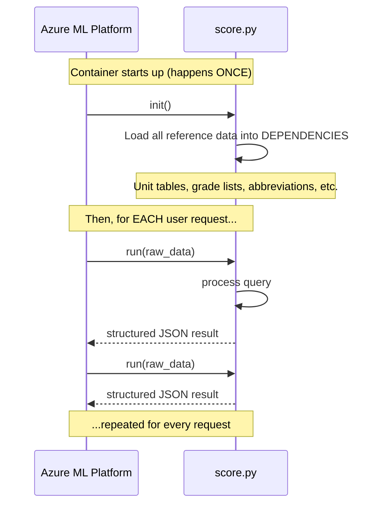

# 2. Big Picture Architecture 🏗️

> How the 4 files fit together, where the AI lives, and how data flows.

---

## The 4 files at a glance

```
flat-repo-ner/onlinescoring/
│
├── score.py            🚪 THE DOOR    — Azure ML calls this. init() + run()
├── pre_processing.py   🧹 CLEANER     — tidy the raw query
├── ner_helper.py       🧠 BRAIN       — orchestrates everything, calls the AI
└── post_processing.py  🔍 INSPECTOR   — validate, convert units, scope-check
```

| File | Nickname | Job | Size |
|------|----------|-----|------|
| `score.py` | The Door | Entry point for Azure ML. Loads data once, handles each request | small |
| `pre_processing.py` | The Cleaner | Normalize/clean the user's text | medium |
| `ner_helper.py` | The Brain | Fast-paths, calls GPT, applies business rules | **large (~1900 lines)** |
| `post_processing.py` | The Inspector | Schema validation, unit conversion, out-of-scope | medium |

---

## How they connect (Mermaid)



### Same thing in ASCII (if Mermaid doesn't render)

```
   🌐 request {data, user_type}
        │
        ▼
   ┌──────────────────────┐
   │  score.py · run()    │   THE DOOR
   └──────────┬───────────┘
              │ run_ner(query, DEPENDENCIES, user_type)
              ▼
   ┌──────────────────────────────────────────────┐
   │      ner_helper.py · run_ner()  (THE BRAIN)   │
   │                                                │
   │   calls ──► pre_processing.py   (clean)        │
   │   calls ──► ☁️ Azure OpenAI GPT (understand)   │
   │   calls ──► post_processing.py  (fix & check)  │
   └──────────┬─────────────────────────────────────┘
              │ structured JSON
              ▼
   ┌──────────────────────┐
   │  score.py · run()    │
   └──────────┬───────────┘
              ▼
        🌐 response
```

---

## Where does the AI actually live? ☁️

The AI is **not** in this codebase. It's a **fine-tuned GPT-4.1-mini model hosted on Azure
OpenAI**. The code just *calls* it over the internet.

```
   ner_helper.py                         Microsoft Azure Cloud
   ┌───────────────────┐                 ┌────────────────────────┐
   │  get_entities()   │  ── HTTPS ──►   │  Fine-tuned GPT-4.1-mini│
   │  (Azure OpenAI    │  ◄── JSON ──    │  deployment             │
   │   client)         │                 │  (trained on Celanese   │
   └───────────────────┘                 │   product queries)      │
                                         └────────────────────────┘
```

To talk to it, the code needs **secret credentials** stored in a `.env` file:

```
azure_openai_key_aif       = <secret API key>
azure_openai_endpoint_aif  = <the Azure URL>
api_version_aif            = <which API version>
```

There are **two deployments**:
- **NPROD** (non-production / testing)
- **PROD** (production / live)

If the primary one fails, the code automatically retries on the other one (a **fallback**).

---

## The Azure ML contract: init() vs run()

This service is deployed as an **Azure ML online endpoint**. Azure ML has a simple rule:

```
   When the server BOOTS UP (once):     ──►  call  init()
   For EVERY incoming request:          ──►  call  run(raw_data)
```



**Why two functions?** Loading all the reference data (CSV/JSON/Excel files) is slow.
You do it **once** at startup (`init`), keep it in memory, and **reuse** it for every
request (`run`). This is the "load once, use many times" pattern.

---

## What `init()` loads (the DEPENDENCIES "toolbox")

`init()` fills one big dictionary called `DEPENDENCIES` — think of it as a **toolbox** the
Brain carries into every job:

```
   DEPENDENCIES  (the toolbox)
   ├── 🤖 GPT settings:  deployment names + system prompt
   ├── 📐 Unit tables:   convert GPa→MPa, etc.            (CSV files)
   ├── 📋 Lookup lists:  known grades, polymers, brands   (JSON files)
   ├── 🔤 Abbreviations: "gf" → "glass fiber"             (Excel file)
   ├── 🚫 Out-of-scope:  what to hide from users          (JSON file)
   ├── 🎨 Color codes:   patterns to strip from grades    (text file)
   └── 🏷️ Versions:      MODEL_VERSION, API_VERSION
```

> ⚠️ Note: these data files live in a `dependencies/` folder. In this particular copy of the
> repo those files are **not present** (only an empty `model-best/` folder exists), which is
> why the code can't actually *run* locally without restoring them — but the *logic* is fully
> intact and is what we're studying here.

---

## The 3-station assembly line (mapped to files)

```
  ┌──────────────┐     ┌──────────────┐     ┌──────────────┐
  │  STATION 1   │     │  STATION 2   │     │  STATION 3   │
  │   CLEAN      │ ──► │  UNDERSTAND  │ ──► │  FIX & CHECK │
  │              │     │              │     │              │
  │pre_processing│     │ Azure OpenAI │     │post_processing│
  │   .py        │     │ GPT model    │     │ .py + rules  │
  └──────────────┘     └──────────────┘     └──────────────┘
     "iron the          "read & label        "verify against
      shirt"             the things"          the rulebook"
```

➡️ Next: [`03-step-by-step-flow.md`](03-step-by-step-flow.md) — the precise sequence of steps for one request.
