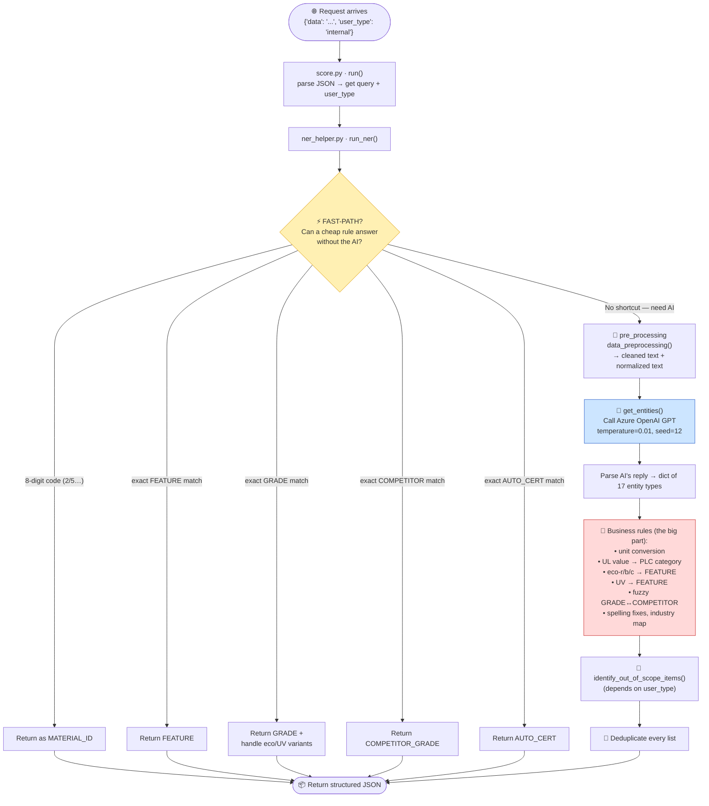
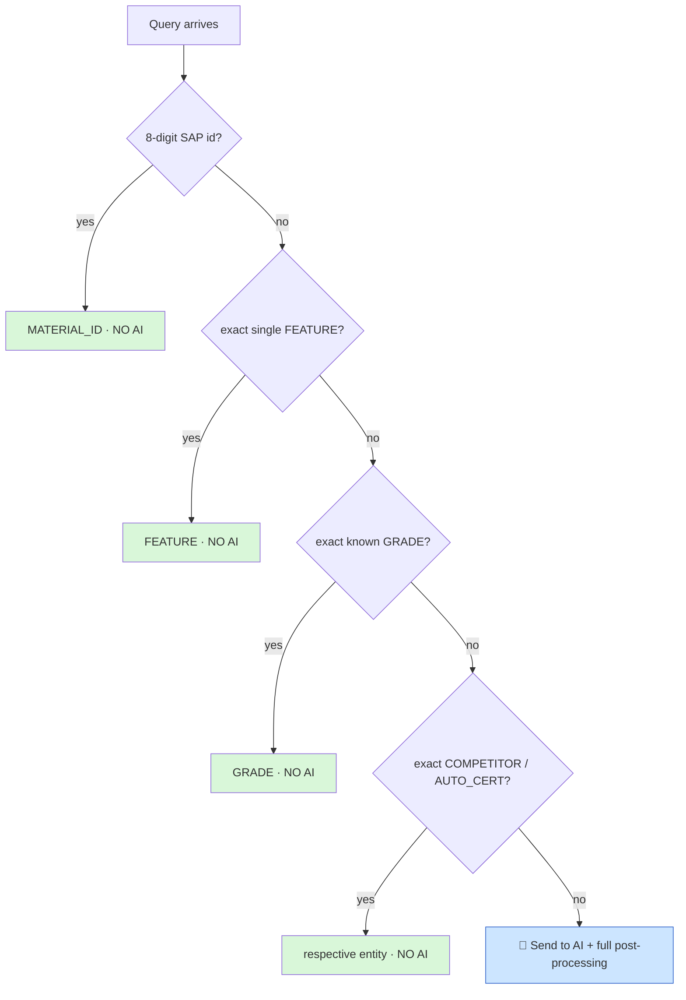

# 3. Step-by-Step Flow 🔄

> Exactly what happens, in order, when ONE request arrives. This is the master flowchart.

---

## The complete journey (Mermaid)



---

## The same flow in plain numbered steps

### STEP 0 — Request comes in (`score.py · run()`)
```
Input:  '{"data": "pa66 30% gf uv stable", "user_type": "internal"}'
Action: json.loads() → search_query = "pa66 30% gf uv stable"
                       user_type    = "internal"  (defaults to "external")
Then:   call run_ner(search_query, DEPENDENCIES, user_type)
```
Everything is wrapped in a `try/except`. If *anything* crashes, `run()` returns a safe
**empty result** so the endpoint never returns an error to the user.

---

### STEP 1 — Fast-path shortcuts (`ner_helper.py`, early in `run_ner`)
Before doing expensive work, check if a simple rule already answers the query:

```
   ┌─ Is it an 8-digit SAP id starting with 2 or 5?  → MATERIAL_ID, done.
   ├─ Is it EXACTLY one known FEATURE (e.g. "pfas-free")? → done.
   ├─ Is it EXACTLY a known GRADE? → done (handle eco-/UV extras).
   ├─ Is it EXACTLY a known COMPETITOR_GRADE? → done.
   └─ Is it EXACTLY a known AUTO_CERT? → done.
```
If any match → **return immediately, skip the AI.** (Saves time + money.)

---

### STEP 2 — Clean the text (`pre_processing.py · data_preprocessing()`)
Produces **TWO** versions of the query:

```
  raw:        "PA66™  30%GF  ≥UV-Stable"
                       │
                       ▼
  cleaned text  →  "pa66 30 gf uv stable"      (goes to the AI — human-readable)
  normalized    →  "pa6630gfuvstable"          (alphanumeric only — for exact matching)
```
What it cleans: strips `® ™ $ #`, normalizes math symbols (`≥`→`>=`), fixes spacing around
`< > = , %`, normalizes temperature (`℃`→`°c`), expands abbreviations (`sg1.4`→`sg of 1.4`),
standardizes eco-labels and brand names.

---

### STEP 3 — Ask the AI (`ner_helper.py · get_entities()`)
```
   send to Azure OpenAI:
       system prompt: "Act as an NER model trained on Celanese data..."
       user message:  "pa66 30 gf uv stable"
       settings:      temperature = 0.01   (almost no randomness)
                      seed        = 12      (repeatable results)

   AI replies with a dictionary like:
       { "GRADE": ["pa66"], "FILLER": [...], "FEATURE": ["uv stable"], ... }
```
If the primary deployment fails → automatically retry on the secondary deployment (fallback).

---

### STEP 4 — Apply business rules (the bulk of `ner_helper.py`)
The AI's output gets cleaned up by hundreds of deterministic rules. Highlights:

```
  • Unit conversion ........ GPa → MPa, etc.        (post_processing.modifier_unit_conversion)
  • UL property values ..... "600 volts" → "PLC 0"  (CTI/HAI/HWI/HVAR/HVTR/Arc converters)
  • eco-r / eco-b / eco-c .. → FEATURE: recycled / bio-content / carbon capture
  • UV terms ............... → FEATURE: "u.v. stabilized or stable to weather"
  • GRADE ↔ COMPETITOR ..... fuzzy match (thefuzz) reclassifies if >80% similar
  • Celstran brand ......... "glass fiber" → "long glass fiber"
  • Spelling fixes ......... "aramide" → "aramid"
  • Industry mapping ....... application text → INDUSTRY label
```

---

### STEP 5 — Out-of-scope check (`post_processing.py · identify_out_of_scope_items()`)
Splits entities into **in-scope** (keep) vs **out-of-scope** (hide), based on `user_type`.

```
   user_type = "external"  →  hide commercial-only & restricted grades/brands
   user_type = "internal"  →  show more, hide fewer
```
Also flags special terms: Toyota certs, FDA / food-contact, medical (ISO 10993), crosslinked, etc.

---

### STEP 6 — Deduplicate & return
Remove duplicate items from every list, then return the final structured JSON all the way back
up through `run()` to the caller.

---

## Decision tree: "Does this query even touch the AI?"



> 🟢 Green = answered by cheap rules (fast, free).
> 🔵 Blue = needs the AI (slower, costs money) — only when rules can't answer.

---

## Why this order matters

```
  CLEAN first   → so the AI gets tidy input and performs better
  AI second     → does the hard "understanding" part
  RULES last    → fix AI mistakes + enforce strict company logic
```

If you cleaned *after* the AI, the AI would choke on messy input.
If you ran rules *before* the AI, you'd have nothing to fix yet.
The order is deliberate.

➡️ Next: [`04-file-by-file.md`](04-file-by-file.md) — open each file and look inside.
