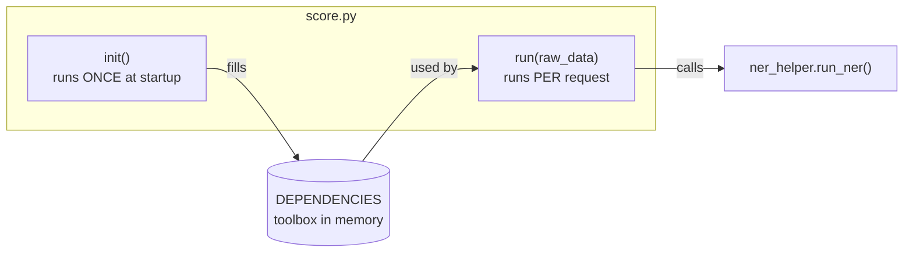
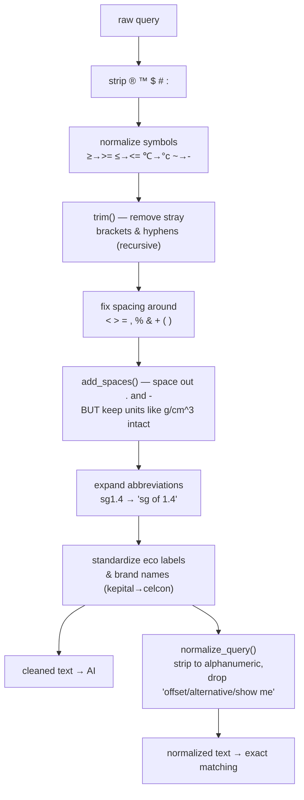
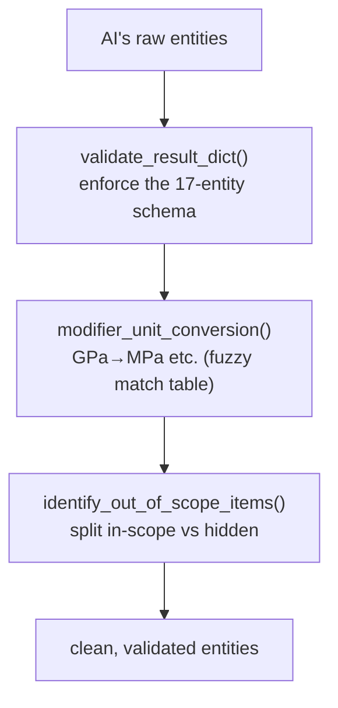
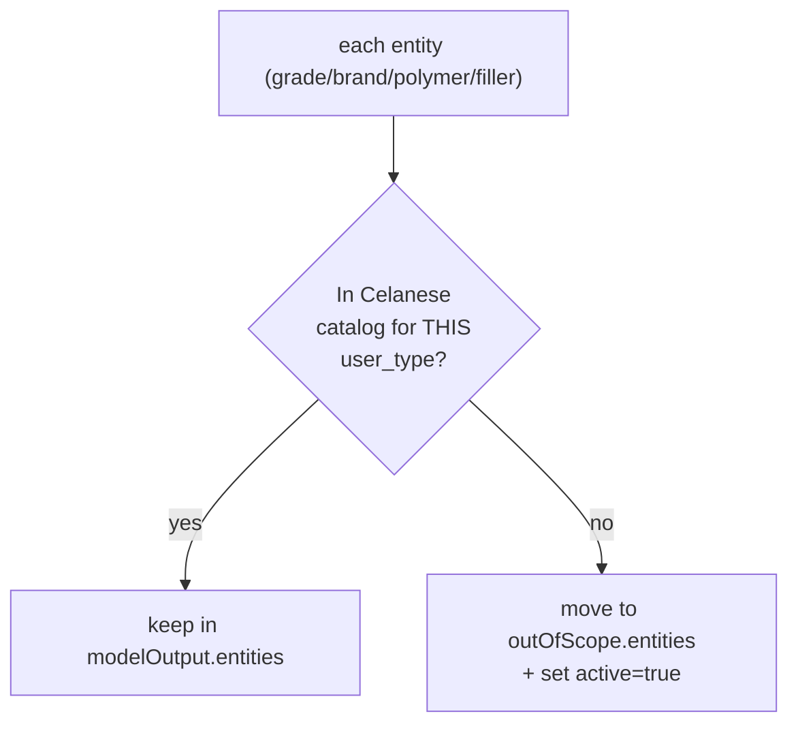

# 4. File-by-File Deep Dive 🔬

> What's inside each file, the key functions, and what they do — with diagrams.

---

## 🚪 `score.py` — The Door (entry point)

Azure ML talks to the service *only* through this file. It has two important functions.



### `init()` — load everything once (lines ~11–165)
Reads all the reference data files and packs them into the global `DEPENDENCIES` dict:

| Loads | From | Used for |
|-------|------|----------|
| Unit conversion tables | `*.csv` | GPa→MPa style conversions |
| Unique values, grade names | `*.json` | Exact matching / lookups |
| Normalized values | `*.json` | Grade & competitor matching |
| Abbreviations | `abbreviations.xlsx` | "gf" → "glass fiber" |
| Out-of-scope data | `*.json` | What to hide per user type |
| Color-code patterns | `*.txt` | Strip color codes from grades |
| GPT deployment names + prompt | hard-coded | Which AI to call + how |

Also sets `MODEL_VERSION` and `API_VERSION` (stamped onto every response).

```
   base_path =  AZUREML_MODEL_DIR   (in the cloud)
             OR "././"              (when running locally = repo root)
```

### `run(raw_data)` — handle one request (lines ~265–347)
```
   1. raw_data = json.loads(raw_data)
   2. search_query = raw_data["data"]
   3. user_type = "internal" if explicitly set, else "external"
   4. try:
          ner_output = run_ner(search_query, DEPENDENCIES, user_type)
      except:
          return a SAFE empty result  ← endpoint never crashes
   5. return ner_output
```

### Lines 350–354 — local test block (the part you asked about)
```python
## local testing
# if __name__ == '__main__':
#     init()
#     ner_output = run('{"data": "pa6-gf60-01", "user_type":"internal"}')
#     print("#"*50, ner_output)
```
This is **commented out**. Uncommenting it lets you run the file directly to test one query
locally (it calls `init()` then `run()` and prints the result). Lines 356+ are a big library
of *other* sample queries you can swap in.

> ⚠️ To actually execute it you'd need the `dependencies/` data files **and** a valid
> `.env` with Azure credentials — see [`08-how-to-test-locally.md`](08-how-to-test-locally.md).

---

## 🧹 `pre_processing.py` — The Cleaner

**Main function:** `data_preprocessing(text, values, units, DEPENDENCIES)`
**Returns:** a tuple → `(cleaned_text_for_AI, normalized_text_for_matching)`



### Helper functions (each does one small cleaning job)
| Function | Job |
|----------|-----|
| `add_spaces()` | Space around `.` `-` but **protect** units/values |
| `remove_brackets()` | Drop `()` `[]` `{}` while keeping the content |
| `remove_unwanted_characters()` | Strip junk symbols from text edges |
| `remove_hyphens()` | Clean leading/trailing/double hyphens |
| `trim()` | Run the above repeatedly until clean |
| `convert_property_shortforms_with_values()` | `hdt200` → `hdt of 200` |
| `normalize_query()` | Make the alphanumeric matching version |

> 💡 Why two output strings? The **cleaned** one keeps words/spaces so the AI reads it naturally.
> The **normalized** one (`pa6630gf`) is squished so it can be compared *exactly* against known
> product codes for the fast-path.

---

## 🧠 `ner_helper.py` — The Brain (the big one, ~1900 lines)

**Main function:** `run_ner(search_query, DEPENDENCIES, user_type)` — orchestrates everything.

### The one function that calls the AI: `get_entities()`
```python
def get_entities(query, ner_prompt, deployment_name):
    completion = client.chat.completions.create(
        seed=12,              # repeatable
        temperature=0.01,     # near-zero randomness → deterministic
        model=deployment_name,
        messages=[
            {"role": "system", "content": ner_prompt},  # "act as NER for Celanese..."
            {"role": "user",   "content": query},        # the cleaned query
        ],
    )
    return completion.choices[0].message.content          # raw text the AI produced
```

### Map of the important functions in `ner_helper.py`
| Function | What it does |
|----------|--------------|
| `run_ner()` | **Master orchestrator** (fast-paths → AI → rules → scope → dedup) |
| `get_entities()` | Calls Azure OpenAI and returns the raw entity dict |
| `replace_abbreviation()` | Expands material abbreviations (tm→tensile modulus, gf→glass fiber) |
| `cti/hai/hwi/hvar/hvtr/arc_value_convertion()` | Convert UL property numbers → PLC categories |
| `update_auto_cert()` / `validate_auto_cert()` | Fix & normalize automotive certifications |
| `get_industry()` | Map an application to an industry |
| `check_for_terms()` | Regex helper "does the query contain any of these terms?" |
| `is_sublist()` / `replace_sublist()` | List-pattern helpers used during cleanup |

### What `run_ner()` does, as a pipeline
```
  run_ner()
    │
    ├─ 1. SAP id?  single FEATURE?  exact GRADE/COMPETITOR/AUTO_CERT?  → fast-path return
    │
    ├─ 2. data_preprocessing()           ← from pre_processing.py
    │
    ├─ 3. choose deployment (NPROD/PROD) + get_entities()  ← the AI call (with fallback)
    │        eval() the AI's text into a Python dict
    │
    ├─ 4. BUSINESS RULES (most of the file):
    │        modifier_unit_conversion()       ← from post_processing.py
    │        UL number → PLC conversions
    │        eco-/UV → FEATURE extraction
    │        fuzzy GRADE↔COMPETITOR reclassification (thefuzz)
    │        Celstran long-fiber logic, spelling fixes, industry mapping
    │
    ├─ 5. identify_out_of_scope_items()   ← from post_processing.py
    │
    └─ 6. deduplicate every list  →  return final JSON
```

---

## 🔍 `post_processing.py` — The Inspector

Three responsibilities: **validate structure**, **convert units**, **detect out-of-scope**.



### Key functions
| Function | Job |
|----------|-----|
| `validate_result_dict()` | Master check: ensures all 17 entity keys exist with correct shapes |
| `validate_property()` / `validate_filler()` | Check nested PROPERTY/FILLER structures |
| `validate_*_cert()` | Check AUTO/RAILWAY/WATER/NSF certification shapes |
| `modifier_unit_conversion()` | Convert property units to Celanese standard units |
| `modifier_unit_conversion_identifier()` | Fuzzy-match a unit against the conversion table (>85% score) |
| `power_numbers_to_proper_format()` | `10^6` → `1000000` |
| `string_to_number()` | Turn a numeric string into a float |
| `identify_out_of_scope_items()` | The out-of-scope engine (uses `user_type`) |

### Unit conversion, visually
```
   AI says:  property = "flexural modulus", value = 2.5, unit = "GPa"
                              │
                              ▼  modifier_unit_conversion()
                  look up "GPa" in conversion table (fuzzy match)
                              │
                              ▼  apply formula (×1000)
   Result:   value = 2500, unit = "MPa <-> GPa"
                                          └── keeps the original unit for reference
```

### Out-of-scope engine, visually

It also scans the raw query for special flags: **Toyota** certs, **FDA / food contact**,
**amorphous**, **FMVSS**, **CFR 21**, **crosslinked**, **MAF/DMF**, **ISO 10993** (medical),
**LTHA**, **USP** — and routes them to the "OTHERS" out-of-scope bucket.

➡️ Next: [`05-worked-example.md`](05-worked-example.md) — follow one real query end to end.
