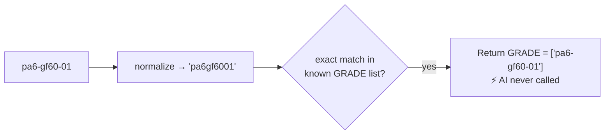

# 5. Worked Example — Follow One Query 🚶

> We trace a single query through every stage so you can *see* the data change shape.

---

## Example query

```json
{ "data": "30% glass filled UV resistant nylon 66 with UL94V0", "user_type": "internal" }
```

A salesperson typed this. Let's watch it become structured data.

---

## Stage 0 — `run()` parses the request (score.py)

```
search_query = "30% glass filled UV resistant nylon 66 with UL94V0"
user_type    = "internal"
```
Calls `run_ner(search_query, DEPENDENCIES, "internal")`.

---

## Stage 1 — Fast-path check (ner_helper.py)

```
   8-digit SAP id?          ✗ no
   exactly one FEATURE?     ✗ no
   exactly a known GRADE?   ✗ no (it's a descriptive sentence, not a code)
   COMPETITOR / AUTO_CERT?  ✗ no
   ───────────────────────────────
   → No shortcut. Proceed to the AI path.
```

---

## Stage 2 — Cleaning (pre_processing.py)

```
   BEFORE:  "30% glass filled UV resistant nylon 66 with UL94V0"
                                  │
                                  ▼  data_preprocessing()
   cleaned text (for AI):  "30 glass filled uv resistant nylon 66 with ul94v0"
   normalized (matching):  "30glassfilleduvresistantnylon66withul94v0"
```
(Lowercased, `%` spaced/handled, ready for the model.)

---

## Stage 3 — The AI extracts entities (get_entities → Azure OpenAI)

The AI reads the cleaned text and returns something like:

```python
{
  "GRADE": [],
  "POLYMER": ["nylon 66"],
  "FILLER": [ {"filler_name": ["glass fiber"],
               "total_load": {"value": 30, "min": null, "max": null}} ],
  "FEATURE": ["uv resistant"],
  "PROPERTY": [ {"property_name": "flammability",
                 "modifier": {"value": "v-0", "min": null, "max": null, "unit": ""},
                 "property_type": "ul_property"} ],
  "APPLICATION": [], "BRAND": [], ...
}
```

The AI understood the *meaning*: it split the sentence into polymer, filler, feature, and a
UL fire-rating property. 

---

## Stage 4 — Business rules tidy it up (ner_helper + post_processing)

```
   • "uv resistant"  →  FEATURE becomes the official phrase
                        "u.v. stabilized or stable to weather"

   • flammability "v-0"  →  kept as a UL property (already a category, no number to convert)

   • unit conversion  →  nothing to convert here (no GPa/units present)

   • spelling/standardization checks  →  "glass fiber" is already correct

   • dedup  →  no duplicates
```

After rules:
```python
"FEATURE": ["u.v. stabilized or stable to weather"]
"PROPERTY": [ {property_name:"flammability", modifier:{value:"v-0",...}, property_type:"ul_property"} ]
```

---

## Stage 5 — Out-of-scope check (post_processing, user_type="internal")

```
   nylon 66      → in catalog for internal users?  ✓ keep
   glass fiber   → in catalog?                       ✓ keep
   → nothing hidden.  outOfScope.active = false
```

---

## Stage 6 — Final structured result

```json
{
  "userInput": { "searchQuery": "30% glass filled UV resistant nylon 66 with UL94V0" },
  "modelOutput": {
    "entities": {
      "GRADE": [],
      "APPLICATION": [],
      "BRAND": [],
      "POLYMER": ["nylon 66"],
      "PROPERTY": [
        { "property_name": "flammability",
          "modifier": { "value": "v-0", "min": null, "max": null, "unit": "" },
          "property_type": "ul_property" }
      ],
      "FILLER": [
        { "filler_name": ["glass fiber"],
          "total_load": { "value": 30, "min": null, "max": null } }
      ],
      "FEATURE": ["u.v. stabilized or stable to weather"],
      "PROCESSING": [], "DELIVERY_FORM": [], "COMPETITOR_GRADE": [],
      "AUTO_CERT": [], "RAILWAY_CERT": [], "WATER_CERT": [], "NSF_CERT": [],
      "INDUSTRY": [], "REGION": [], "MATERIAL_ID": []
    },
    "unidentified": "",
    "outOfScope": { "active": false,
                    "entities": { "GRADE": [], "BRAND": [], "POLYMER": [], "FILLER": [], "OTHERS": [] } }
  },
  "modelVersion": "GPT-4-1-mini-17_04_26",
  "apiVersion": "v5.8.4"
}
```

The warehouse computer can now search precisely: *nylon 66 + 30% glass fiber + UV stabilized + flammability V-0.* ✅

---

## The transformation at a glance

```
  "30% glass filled UV resistant nylon 66 with UL94V0"
            │
            │   CLEAN  ──►  UNDERSTAND (AI)  ──►  FIX & CHECK
            ▼
  ┌──────────────────────────────────────────┐
  │ POLYMER:  nylon 66                         │
  │ FILLER:   glass fiber @ 30%               │
  │ FEATURE:  u.v. stabilized or stable...    │
  │ PROPERTY: flammability = V-0 (UL)          │
  └──────────────────────────────────────────┘
```

---

## A second example — the FAST-PATH (no AI used)

Query: `{ "data": "pa6-gf60-01", "user_type": "internal" }`



Because it's an exact known grade code, the service answers instantly and **never pays for an
AI call.** That's the fast-path from [`03-step-by-step-flow.md`](03-step-by-step-flow.md) in action.

➡️ Next: [`06-all-diagrams.md`](06-all-diagrams.md) — every diagram collected for quick reference.
