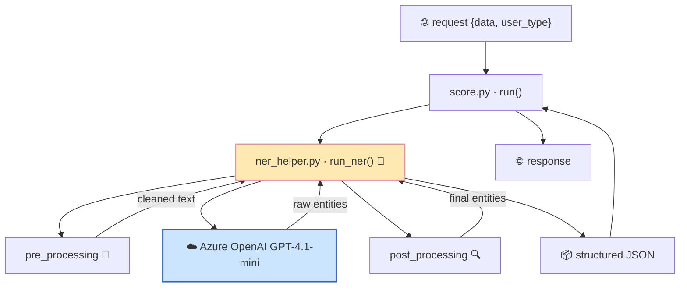
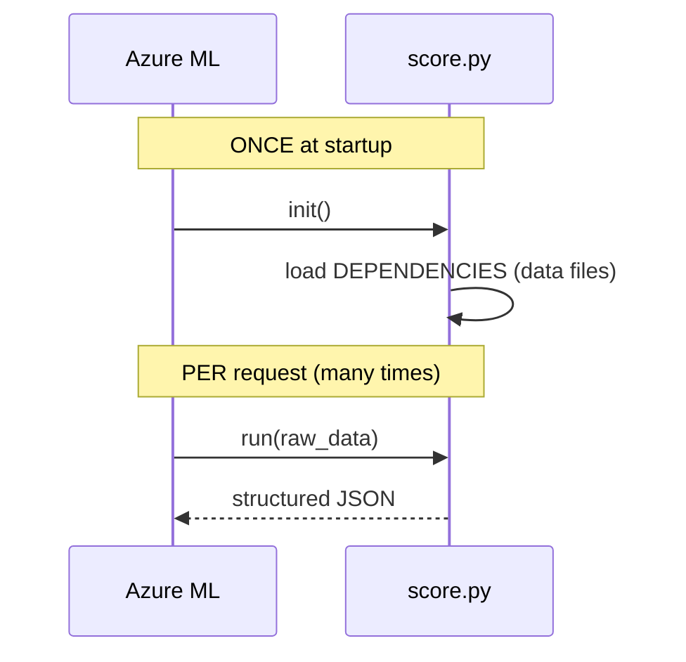
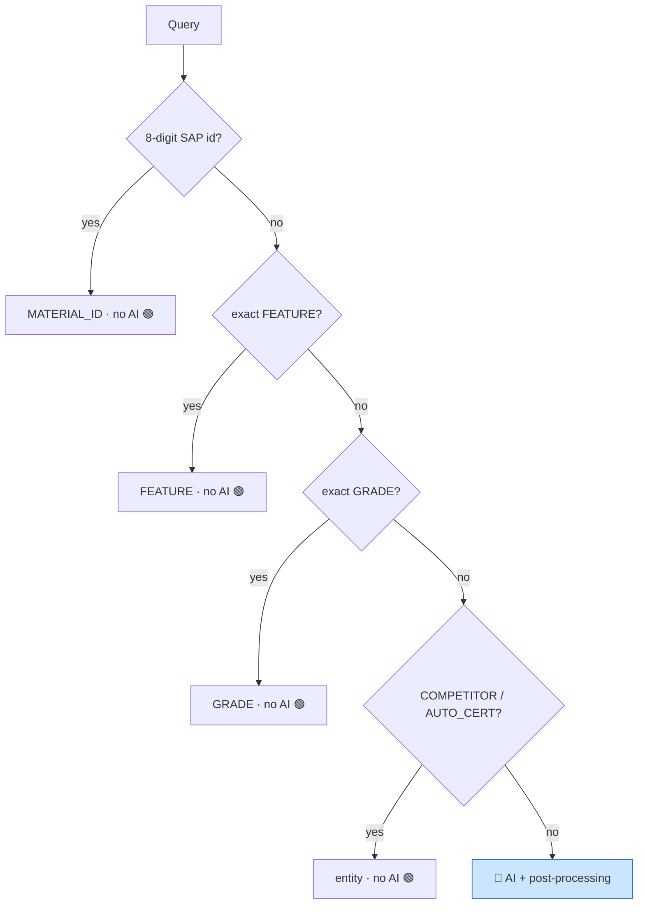
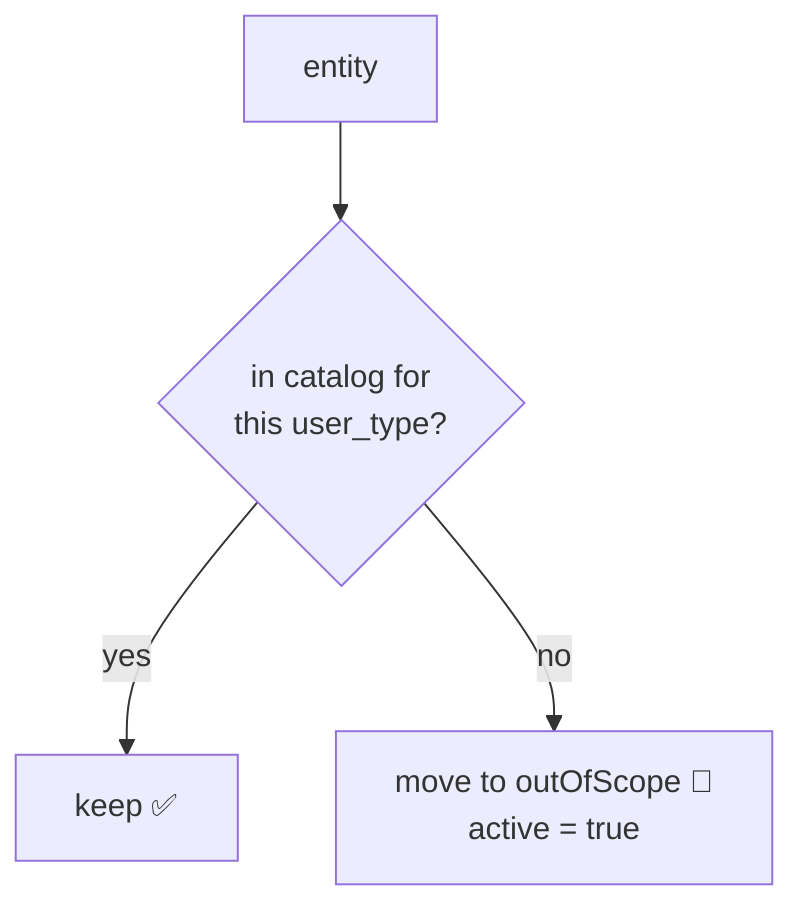

# 6. All Diagrams — Cheat Sheet 🗺️

> Every diagram in one place. Print this page if you want a quick reference.

---

## 1) The one-line mental model

```
  messy human words  ──►  [ NER SERVICE ]  ──►  clean structured facts
```

---

## 2) The 3-station assembly line

```
  ┌──────────────┐     ┌──────────────┐     ┌──────────────┐
  │   CLEAN      │ ──► │  UNDERSTAND  │ ──► │  FIX & CHECK │
  │pre_processing│     │ Azure GPT AI │     │post_processing│
  └──────────────┘     └──────────────┘     └──────────────┘
```

---

## 3) The 4 files

```
  score.py            🚪 entry point (init + run)
     │ calls
  ner_helper.py       🧠 brain (run_ner) ── calls ──► Azure OpenAI ☁️
     │ calls                │ calls
  pre_processing.py   🧹    post_processing.py 🔍
```

---

## 4) System architecture (Mermaid)



---

## 5) Azure ML lifecycle: init() vs run()



---

## 6) Master request flow (Mermaid)

```mermaid
flowchart TD
    START(["🌐 request"]) --> RUN["score.run() → ner_helper.run_ner()"]
    RUN --> FP{"⚡ fast-path?"}
    FP -->|SAP id| M[MATERIAL_ID]
    FP -->|FEATURE| FEAT[FEATURE]
    FP -->|GRADE| GR[GRADE]
    FP -->|COMPETITOR/CERT| CG[respective entity]
    FP -->|no| CLEAN["🧹 pre_processing"]
    CLEAN --> GPT["🧠 Azure OpenAI (temp 0.01, seed 12)"]
    GPT --> RULES["🔧 business rules"]
    RULES --> OOS["🚫 out-of-scope (by user_type)"]
    OOS --> DEDUP["🧽 dedup"]
    M --> END
    FEAT --> END
    GR --> END
    CG --> END
    DEDUP --> END(["📦 JSON result"])
    style FP fill:#fff0b3,stroke:#d90
    style GPT fill:#cce5ff,stroke:#36c
    style RULES fill:#ffd9d9,stroke:#c33
```



---

## 7) "Does it touch the AI?" decision tree



---

## 8) Pre-processing: two outputs

```
                       ┌─► cleaned text   →  the AI    (human-readable)
   raw query ──clean──►│
                       └─► normalized text →  matching (alphanumeric only)
```

---

## 9) Inside ner_helper.run_ner()

```
  run_ner()
    ├─ fast-path returns (SAP / FEATURE / GRADE / COMPETITOR / AUTO_CERT)
    ├─ data_preprocessing()            (pre_processing.py)
    ├─ get_entities()                  (Azure OpenAI, with fallback)
    ├─ business rules:
    │     modifier_unit_conversion()   (post_processing.py)
    │     UL number → PLC category
    │     eco-/UV → FEATURE
    │     fuzzy GRADE↔COMPETITOR (thefuzz)
    │     spelling/industry/Celstran rules
    ├─ identify_out_of_scope_items()   (post_processing.py)
    └─ deduplicate → return JSON
```

---

## 10) Unit conversion

```
   value=2.5  unit="GPa"
        │ fuzzy-match "GPa" in conversion table
        │ apply formula (×1000)
        ▼
   value=2500 unit="MPa <-> GPa"   (original kept after the <-> )
```

---

## 11) Out-of-scope split



---

## 12) The 17 entity types (the output form)

```
   GRADE            APPLICATION      BRAND           POLYMER
   PROPERTY*        FILLER*          FEATURE         PROCESSING
   DELIVERY_FORM    COMPETITOR_GRADE AUTO_CERT*      RAILWAY_CERT*
   WATER_CERT*      NSF_CERT         INDUSTRY        REGION
   MATERIAL_ID

   * = nested structure (dict with sub-fields), the rest are simple lists
```

---

## 13) Hybrid design — why AI + rules

```
   AI (GPT)            →  great at UNDERSTANDING messy language
   Rules (Python)      →  great at STRICT correctness (units, scope, spelling)
   ───────────────────────────────────────────────────────────────
   Together            →  reliable + cheap to fix (no retraining for small bugs)
```

➡️ Next: [`07-glossary.md`](07-glossary.md) — plain-English meaning of every term.
