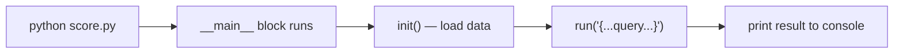
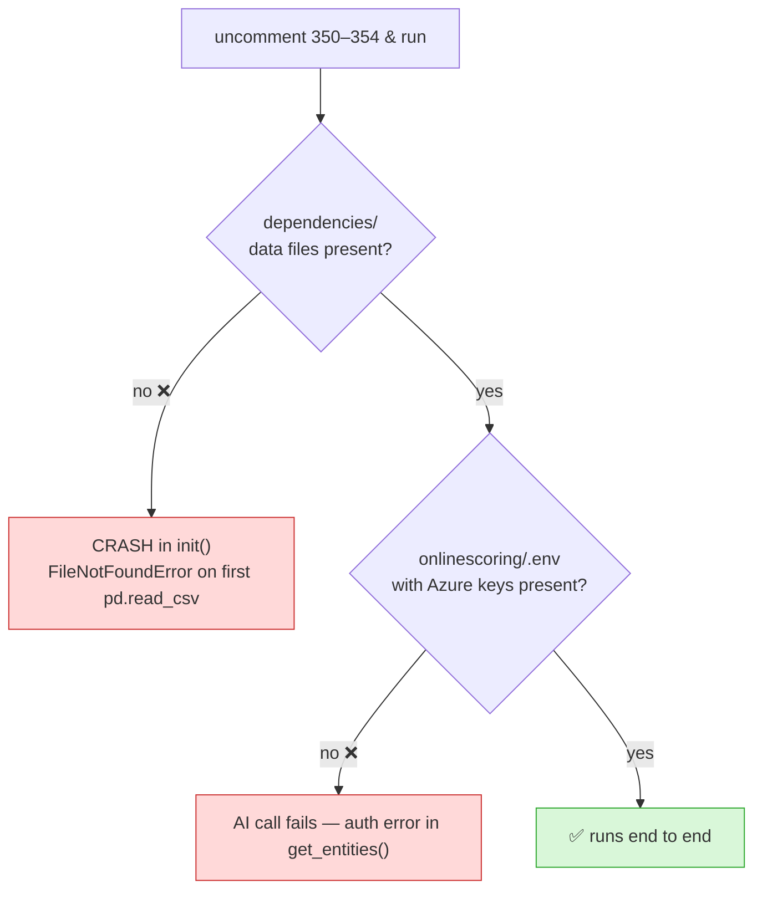

# 8. About Local Testing (lines 350–354) 🧪

> You mentioned uncommenting lines 350–354 in `score.py` to test. Here's what that does and
> what's needed to make it actually run. (We are **not** running anything here — this is reference.)

---

## What lines 350–354 are

At the bottom of `score.py`:

```python
## local testing
# if __name__ == '__main__':
#     init()
#     ner_output = run('{"data": "pa6-gf60-01", "user_type":"internal"}')
#     print("#"*50, ner_output)
```

This is a **local test harness**. It's commented out so it doesn't run in production.

### What each line does
```
if __name__ == '__main__':     ← "only run this when I execute score.py directly"
    init()                     ← load all reference data into DEPENDENCIES
    ner_output = run('{...}')   ← process ONE sample query through the full pipeline
    print("#"*50, ner_output)  ← print a separator line + the result
```

Lines 356+ are a **library of other sample queries** (all commented). To test a different
input, you swap which `run(...)` line is uncommented.



---

## ⚠️ Two things must exist first, or it will crash



### 1) The `dependencies/` data files
`init()` reads many files like:
```
dependencies/final_unit_conversion_table.csv
dependencies/unique_values_22_02_24.json
dependencies/abbreviations.xlsx
dependencies/normalized_unique_values_for_grade_mapping.json
... and more
```
In **this** copy of the repo, the `dependencies/` folder only contains an empty `model-best/`
folder — **the actual data files are missing.** The very first `pd.read_csv(...)` in `init()`
would raise `FileNotFoundError`.

> ✅ Fix: obtain/restore the real `dependencies/` files (they're registered as a model in Azure ML).

### 2) The `.env` file with Azure credentials
`ner_helper.py` builds the Azure OpenAI client from environment variables:
```
azure_openai_key_aif       = <secret>
azure_openai_endpoint_aif  = <azure url>
api_version_aif            = <version>
```
The README says to place a `.env` file in the `onlinescoring/` folder. Without valid
credentials (and access to the deployed fine-tuned model), `get_entities()` will fail to
authenticate.

> ✅ Fix: add `onlinescoring/.env` with valid Azure OpenAI credentials.

---

## What the README says about local testing

The project README has its own snippet (slightly different query):
```python
if __name__ == '__main__':
    init()
    ner_output = run('{"data": "(looking for a material with tensile modulus of 2000 MPa)"}')
    print(ner_output)
```
Same idea: `init()` once, then `run()` a query.

---

## Summary

| Item | Status in this repo copy | Needed to run |
|------|--------------------------|---------------|
| Code logic | ✅ complete and intact | — |
| `dependencies/` data files | ❌ missing | must restore |
| `onlinescoring/.env` | ❌ missing | must add Azure creds |
| Internet access to Azure OpenAI | depends on your machine | required for the AI call |

So uncommenting lines 350–354 is **correct for testing**, but on its own it won't run until
the two missing pieces above are supplied. The KT in this folder explains the full *logic*
regardless — you don't need to run it to understand it.

⬅️ Back to [`00-README-START-HERE.md`](00-README-START-HERE.md)
