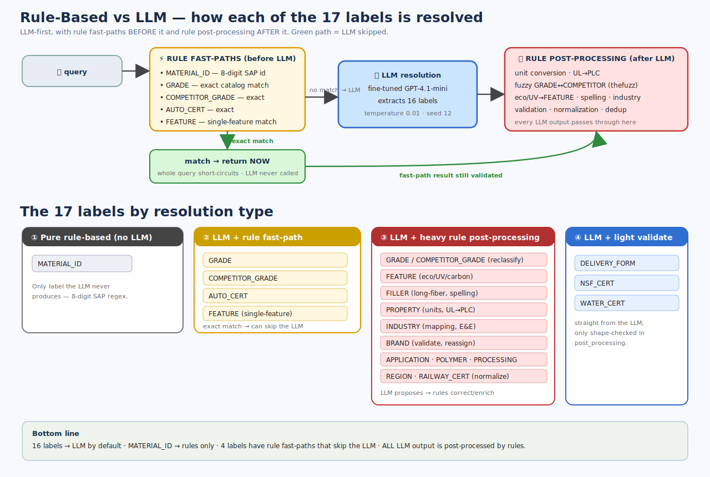

# 11. Rule-Based vs LLM — who resolves each label? 🧩

> Which of the 17 NER labels are produced by the **fine-tuned GPT model** and which by
> **deterministic rules** — verified against `ner_helper.py` with line numbers.



---

## The mental model

It is **not** a clean "this label = rules, that label = LLM" split. The system is **LLM-first
with rules on both sides**:

```
   ┌─ BEFORE the LLM ─────────┐   ┌── LLM ──┐   ┌─ AFTER the LLM ────────────┐
   │ rule fast-paths:         │   │ extracts │   │ rule post-processing:      │
   │ exact GRADE / SAP id /   │──►│ 16 labels│──►│ convert · reclassify ·     │
   │ COMPETITOR / AUTO_CERT / │   │          │   │ augment · validate · dedup │
   │ single FEATURE  → return │   └──────────┘   └────────────────────────────┘
   │ (LLM skipped entirely)   │
   └──────────────────────────┘
```

- **16 labels** are resolved by the **LLM** as the default path.
- **MATERIAL_ID** is the **only pure rule-based** label (the LLM never produces it).
- A few labels have **rule fast-paths** that can answer *without* the LLM on exact catalog matches.
- **Every** LLM output then runs through rule-based post-processing (some far more than others).

---

## Category 1 — Purely rule-based (LLM never involved)

| Label | How it's resolved | Lines |
|-------|-------------------|-------|
| **MATERIAL_ID** | 8-digit SAP id regex (starts with 2/5). Not in model training. | ~778–818 (`805`) |

---

## Category 2 — Rule FAST-PATH that bypasses the LLM

On an **exact** match against the catalog, `run_ner()` returns immediately and the LLM is
**never called for that query**.

| Label | Trigger | Lines |
|-------|---------|-------|
| **GRADE** | exact match vs `NORMALIZED_UNIQUE_VALUES['GRADE']` | 938–1086 |
| **COMPETITOR_GRADE** | exact match vs competitor-grade list | 1088–1137 |
| **AUTO_CERT** | exact match vs auto-cert list | 1139–1193 |
| **FEATURE** | single-feature exact match (e.g. `pfas-free`) | 891–936 |

> ⚠️ A fast-path is a **whole-query short-circuit** — when it hits, *no* label is sent to the LLM.

---

## Category 3 — LLM-extracted, then heavily corrected/augmented by rules

The LLM proposes these; rules then reclassify, convert, or enrich them.

| Label | Rule logic applied after the LLM | Lines |
|-------|----------------------------------|-------|
| **GRADE / COMPETITOR_GRADE** | fuzzy reclassify between the two (`thefuzz` > 80%), color-code stripping, eco/UV extraction, `blueridge`/`litepol` → BRAND | 1365–1509 |
| **FEATURE** | eco-r/b/c → recycled / bio-content / carbon-capture, UV detection, carbon-capture keywords, synonym normalization | 1471–1551, 1723–1748 |
| **FILLER** | Celstran → long-fiber variants, `aramide`→`aramid`, total_load cleanup | 1295–1323 |
| **PROPERTY** | unit conversion (GPa→MPa), UL→PLC (CTI/HAI/HWI/HVAR/HVTR/Arc), hardness mapping | 1325–1326 + post_processing |
| **INDUSTRY** | LLM + `get_industry()` keyword mapping + Electrical&Electronics detection | 1685–1711 |
| **AUTO_CERT** | LLM + `validate_auto_cert()` / `update_auto_cert()` | 1516–1517 |
| **BRAND** | LLM + validated vs `NORMALIZED_UNIQUE_VALUES['BRAND']` (invalid removed) + reassignments | 1334–1339 |
| **APPLICATION** | LLM + medical → FEATURE move, generic-word removal | ~1630–1643 |
| **POLYMER** | LLM + `pbt` → `polyester` correction | 1511–1514 |
| **PROCESSING** | LLM + molding / spelling fixes | 1523–1529 |
| **REGION** | LLM + normalization (`africa middle east` → `europe middle east africa`) | 1451–1453 |
| **RAILWAY_CERT** | LLM + hazard_level / req_set normalization | 1519–1521 |

---

## Category 4 — LLM-extracted, only light structural validation

No business reclassification — just shape checks in `post_processing.py`.

| Label | Note |
|-------|------|
| **DELIVERY_FORM** | from LLM, schema-validated only |
| **NSF_CERT** | from LLM, validated as a list |
| **WATER_CERT** | from LLM, structure-validated (standard, temp) |

---

## Quick lookup — all 17 labels

| Label | Resolved by | Fast-path? (skips LLM) |
|-------|-------------|------------------------|
| MATERIAL_ID | **Rules only** | — (rule short-circuit) |
| GRADE | LLM + heavy rules | ✅ exact match |
| COMPETITOR_GRADE | LLM + heavy rules | ✅ exact match |
| AUTO_CERT | LLM + rules | ✅ exact match |
| FEATURE | LLM + heavy rules | ✅ single-feature match |
| FILLER | LLM + heavy rules | ❌ |
| PROPERTY | LLM + heavy rules | ❌ |
| INDUSTRY | LLM + rules | ❌ |
| BRAND | LLM + validation | ❌ |
| APPLICATION | LLM + rules | ❌ |
| POLYMER | LLM + rules | ❌ |
| PROCESSING | LLM + rules | ❌ |
| REGION | LLM + rules | ❌ |
| RAILWAY_CERT | LLM + normalization | ❌ |
| DELIVERY_FORM | LLM + validation only | ❌ |
| NSF_CERT | LLM + validation only | ❌ |
| WATER_CERT | LLM + validation only | ❌ |

> 💡 Design rationale (from the README): *"Avoid frequent finetuning if a NER issue can be
> fixed by a rule-based approach."* That's why so much logic lives in rules around the LLM —
> it's cheaper to fix a rule than to retrain the model. See [`01-explain-like-im-5.md`](01-explain-like-im-5.md).

⬅️ Back to [`00-README-START-HERE.md`](00-README-START-HERE.md)
