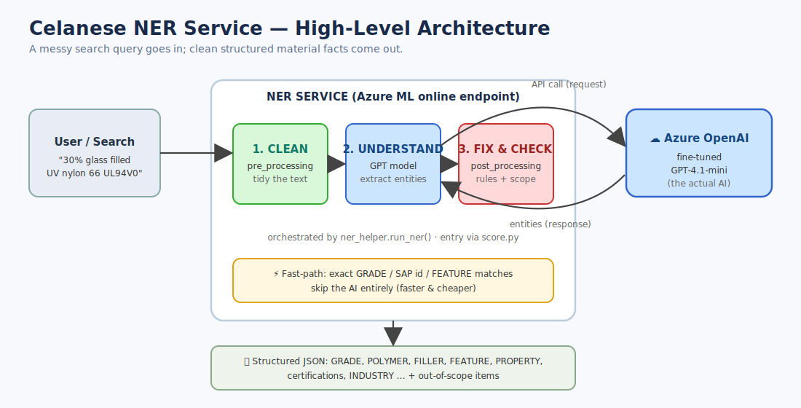
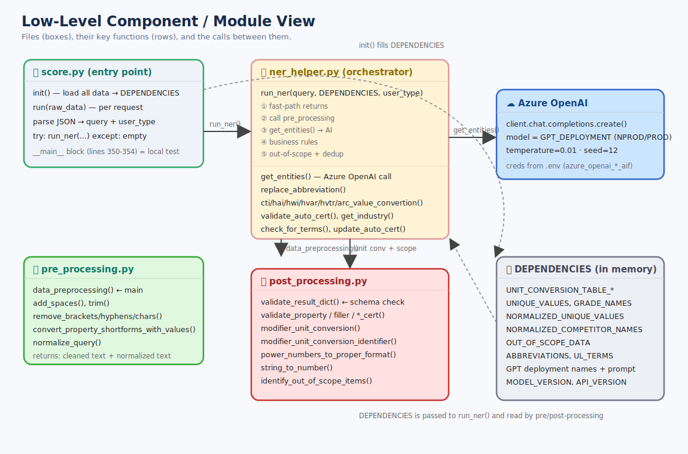
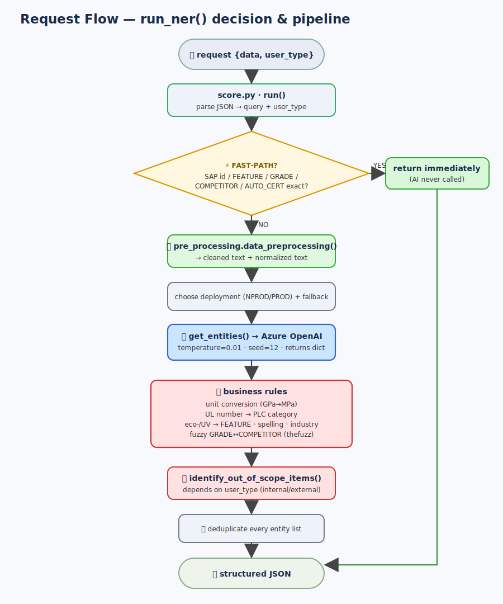
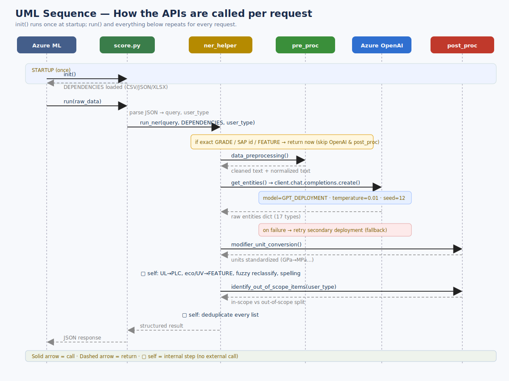
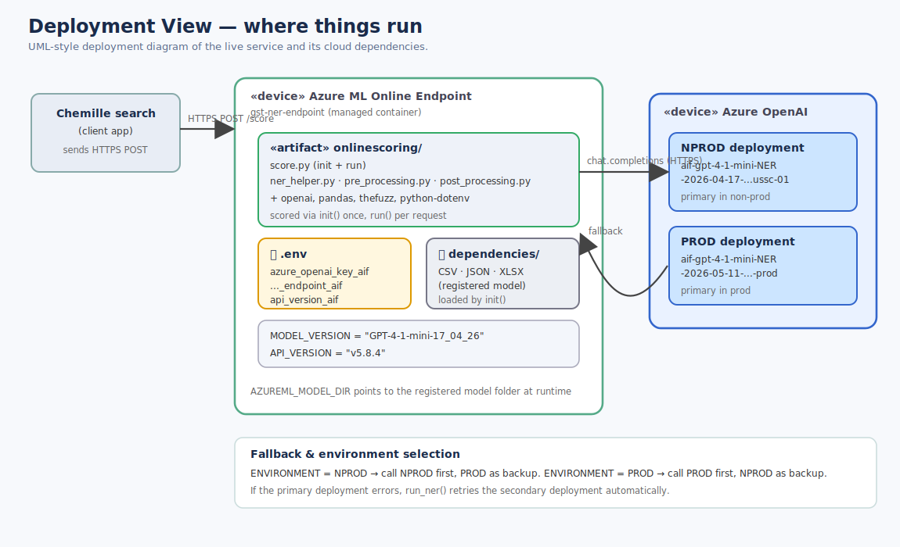
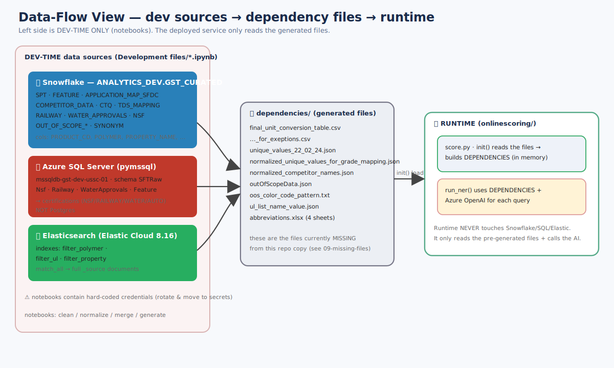
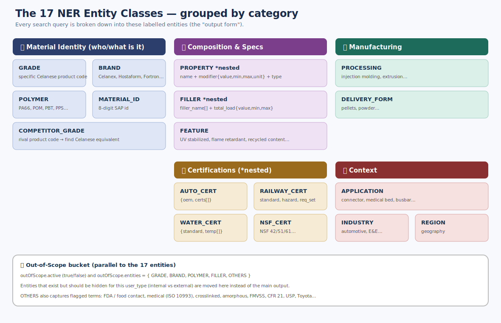
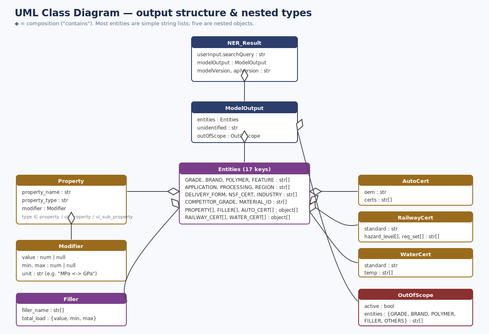
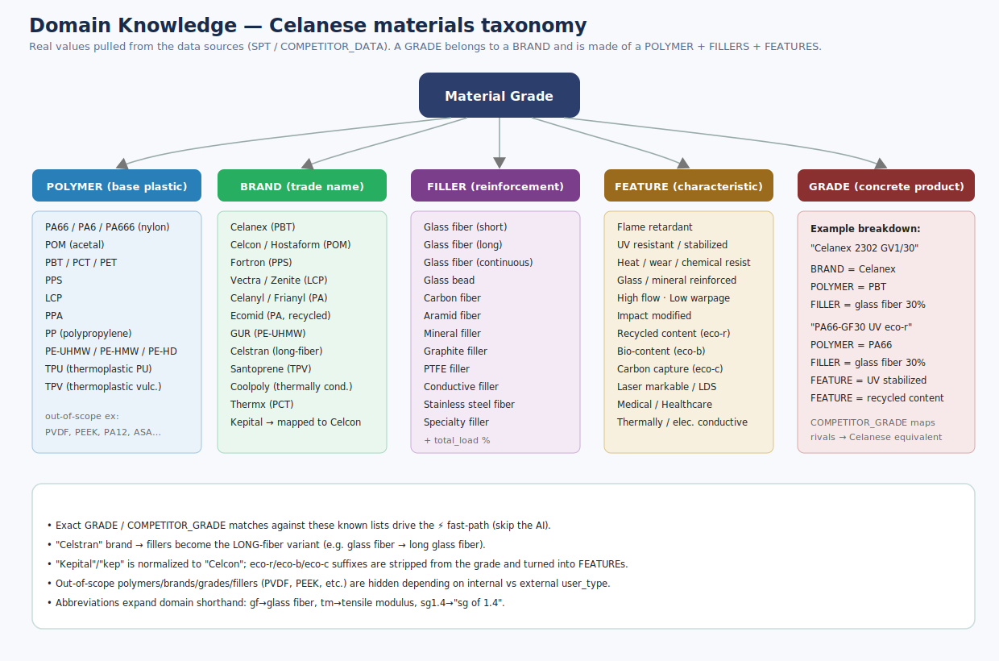
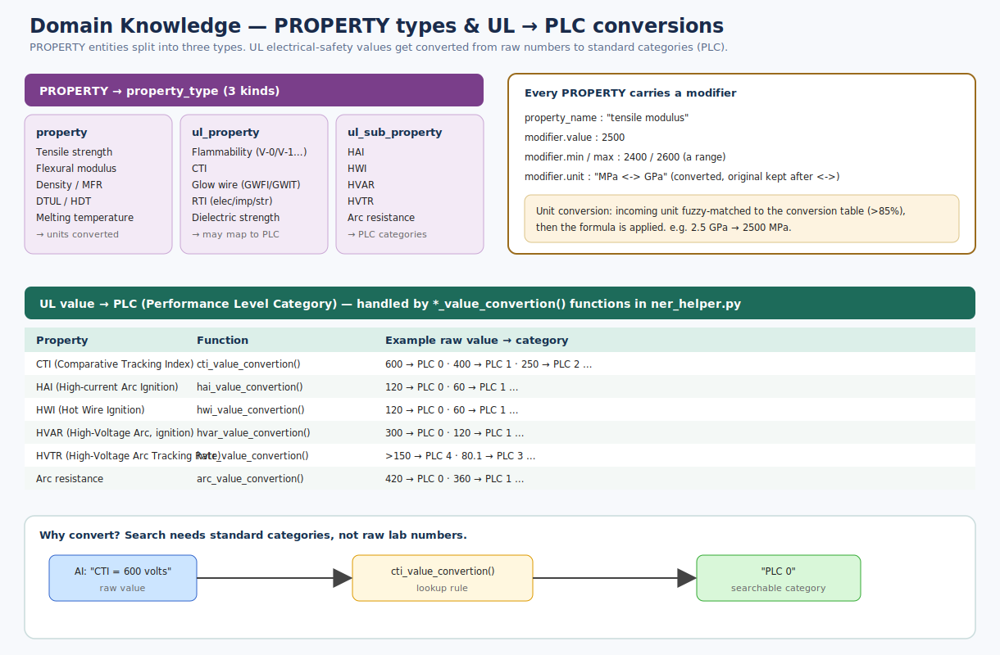

# 🖼️ Diagram Gallery

All diagrams are **SVG** (vector images) — they open in any web browser, VS Code, or image
viewer, render crisply at any zoom, and embed directly in markdown (shown below).

> **Want PNGs?** Open any `.svg` in a browser and "Save as image", or run a converter
> (e.g. `npx svgexport file.svg file.png 2x`, or Inkscape / ImageMagick if installed).
> No SVG renderer was available in this environment, so only SVGs were generated.

---

## Group A — Architecture & API call views

### 1. High-Level Architecture
The whole system as a 3-station assembly line (clean → understand → fix), with the AI cloud.

### 2. Low-Level Component / Module View
Every file, its key functions, the calls between them, and the `DEPENDENCIES` toolbox.

### 3. Request Flow (Block Diagram)
The `run_ner()` decision tree + pipeline, including the ⚡ fast-path that skips the AI.

### 4. UML Sequence — How the APIs are called
Time-ordered call/return between Azure ML, score.py, ner_helper, pre/post-processing and Azure OpenAI.

### 5. Deployment View
Where things run: the Azure ML endpoint container, `.env`, `dependencies/`, and the two GPT deployments (NPROD/PROD with fallback).

### 6. Data-Flow View (dev pipeline)
How Snowflake / Azure SQL / Elasticsearch feed the generated dependency files that the runtime reads.

---

## Group B — NER classes & domain knowledge

### 7. The 17 NER Entity Classes
All entity types grouped by category (identity, composition, manufacturing, certifications, context) + the out-of-scope bucket.

### 8. UML Class Diagram — output structure
The nested object types: Property/Modifier, Filler, AutoCert, RailwayCert, WaterCert, OutOfScope.

### 9. Materials Taxonomy (domain knowledge)
Real Celanese values: polymers, brands, fillers, features — and how a GRADE is composed from them.

### 10. PROPERTY types & UL → PLC conversions
The three property types and the electrical-safety value→category conversions (CTI/HAI/HWI/HVAR/HVTR/Arc).

### 11. Rule-Based vs LLM — how each label is resolved
LLM-first with rule fast-paths before it and rule post-processing after it; all 17 labels categorized.

---

| # | File | View type |
|---|------|-----------|
| 1 | `01-highlevel-architecture.svg` | High-level block |
| 2 | `02-lowlevel-components.svg` | Low-level component |
| 3 | `03-request-flow-blockdiagram.svg` | Flow / block |
| 4 | `04-sequence-uml-api-calls.svg` | UML sequence |
| 5 | `05-deployment-view.svg` | UML deployment |
| 6 | `06-dataflow-dev-pipeline.svg` | Data-flow |
| 7 | `07-ner-entity-classes.svg` | Domain — entity classes |
| 8 | `08-class-hierarchy-uml.svg` | UML class hierarchy |
| 9 | `09-materials-taxonomy.svg` | Domain — taxonomy |
| 10 | `10-properties-ul-plc-knowledge.svg` | Domain — properties/PLC |
| 11 | `11-rulebased-vs-llm.svg` | Rule-based vs LLM resolution |
